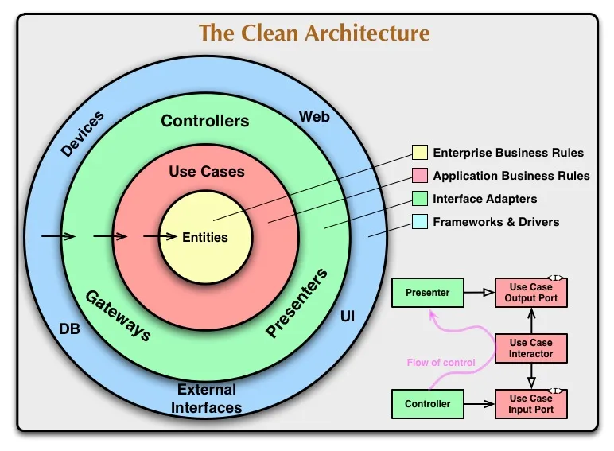

## Clean Architecture

Clean Architecture is a software design philosophy introduced by Robert.C.Martin (Uncle Bob). It's used to create software system to make modular, maintainable, and independent of external frameworks, databases, and user interfaces.

# Main principles:

<strong>1. Independent of Frameworks:</strong> The core business logic and rules should not be dependent on the frameworks or external tools. This allows for flexibility in choosing and changing the tools without affecting the core business logic.

<strong>2. Testable:</strong> The business rules can be tested without the UI, Database, Web Server, or any other external element.

<strong>3. Independent of UI:</strong> The UI can change easily, without changing the rest of the system. A Web UI could be replaced with a console UI, for example, without changing the business rules.

- Example: Today you’re using Express as an UI framework, then tomorrow you can change to Nest, the rest of the layers has to be unchanged only replacing that specific UI framework.

<strong>4. Independent of Database: </strong> You can swap out Oracle or SQL Server, for Mongo, BigTable, CouchDB, or something else. Your business rules are not bound to the database.

<strong>5. Independent of any external agency:</strong> In fact your business rules simply don’t know anything at all about the outside world.

- Example: Your core business logic is sending email then it shouldn’t supposed to know or care about whether it’s using SendGrid or Resend.
